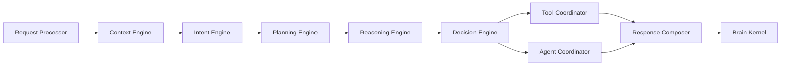
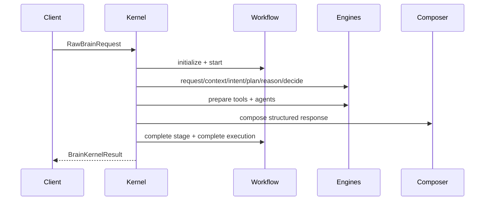

### Phase 3 Component Interactions

### Component Diagram

```mermaid
flowchart LR
    Request[Request Processor] --> Context[Context Engine]
    Context --> Intent[Intent Engine]
    Intent --> Planning[Planning Engine]
    Planning --> Reasoning[Reasoning Engine]
    Reasoning --> Decision[Decision Engine]
    Decision --> Tools[Tool Coordinator]
    Decision --> Agents[Agent Coordinator]
    Tools --> Response[Response Composer]
    Agents --> Response
    Response --> Kernel[Brain Kernel]
```

### Sequence Diagram

```mermaid
sequenceDiagram
    participant Client
    participant Kernel
    participant Workflow
    participant Engines
    participant Composer

    Client->>Kernel: RawBrainRequest
    Kernel->>Workflow: initialize + start
    Kernel->>Engines: request/context/intent/plan/reason/decide
    Kernel->>Engines: prepare tools + agents
    Kernel->>Composer: compose structured response
    Kernel->>Workflow: complete stage + complete execution
    Kernel-->>Client: BrainKernelResult
```
