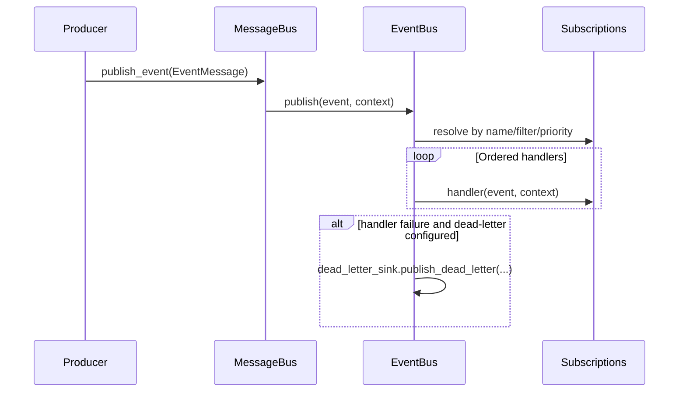
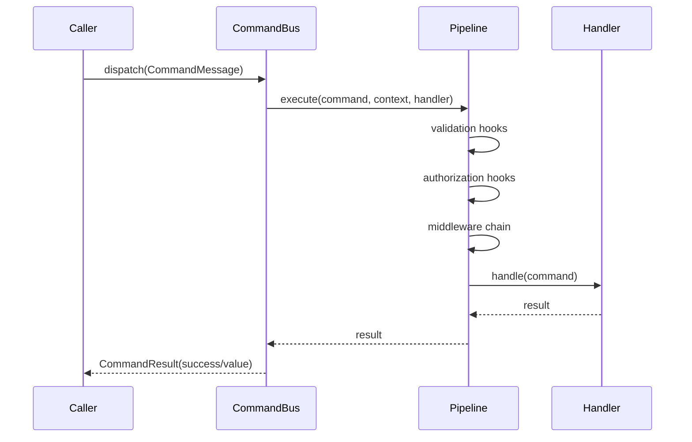
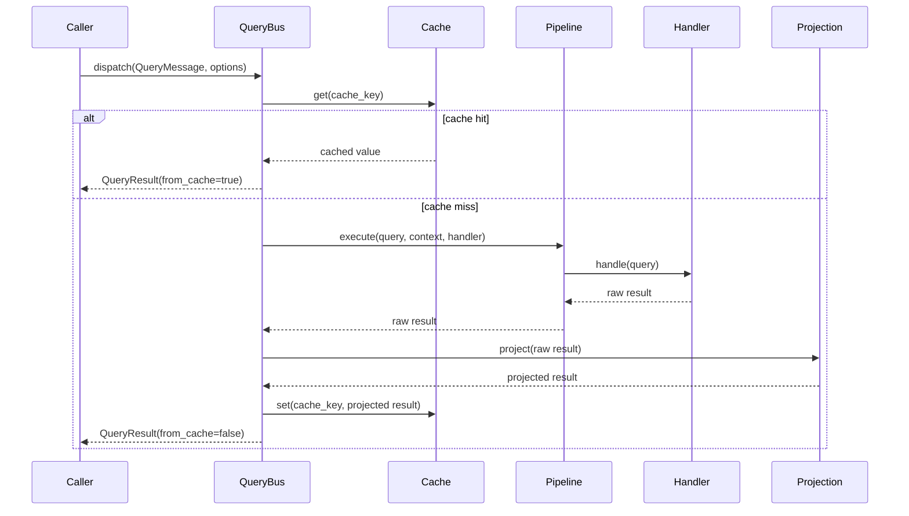

# Phase 5 — Sequence Diagrams

## Event Publishing

```mermaid
sequenceDiagram
    participant Producer
    participant MessageBus
    participant EventBus
    participant Subscriptions
    Producer->>MessageBus: publish_event(EventMessage)
    MessageBus->>EventBus: publish(event, context)
    EventBus->>Subscriptions: resolve by name/filter/priority
    loop Ordered handlers
        EventBus->>Subscriptions: handler(event, context)
    end
    alt handler failure and dead-letter configured
        EventBus->>EventBus: dead_letter_sink.publish_dead_letter(...)
    end
```

## Command Dispatch

```mermaid
sequenceDiagram
    participant Caller
    participant CommandBus
    participant Pipeline
    participant Handler
    Caller->>CommandBus: dispatch(CommandMessage)
    CommandBus->>Pipeline: execute(command, context, handler)
    Pipeline->>Pipeline: validation hooks
    Pipeline->>Pipeline: authorization hooks
    Pipeline->>Pipeline: middleware chain
    Pipeline->>Handler: handle(command)
    Handler-->>Pipeline: result
    Pipeline-->>CommandBus: result
    CommandBus-->>Caller: CommandResult(success/value)
```

## Query Dispatch

```mermaid
sequenceDiagram
    participant Caller
    participant QueryBus
    participant Cache
    participant Pipeline
    participant Handler
    participant Projection
    Caller->>QueryBus: dispatch(QueryMessage, options)
    QueryBus->>Cache: get(cache_key)
    alt cache hit
        Cache-->>QueryBus: cached value
        QueryBus-->>Caller: QueryResult(from_cache=true)
    else cache miss
        QueryBus->>Pipeline: execute(query, context, handler)
        Pipeline->>Handler: handle(query)
        Handler-->>Pipeline: raw result
        Pipeline-->>QueryBus: raw result
        QueryBus->>Projection: project(raw result)
        Projection-->>QueryBus: projected result
        QueryBus->>Cache: set(cache_key, projected result)
        QueryBus-->>Caller: QueryResult(from_cache=false)
    end
```
