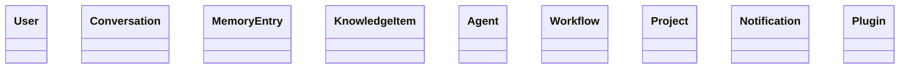

### Domain architecture

- `jarvis_core.domain.shared` contains framework-agnostic primitives, immutable value objects, domain events, aggregate/entity bases, exceptions, and specifications.
- Bounded contexts implemented: Identity, Conversations, Memory, Knowledge, Agents, Workflows, Projects, Notifications, Plugins.
- Repository contracts and ports are defined as `Protocol` interfaces only.

### Entity relationships (high level)

- `User` owns `Profile`, `Role`, `Preference`, `Device` and is linked to `Session`.
- `Conversation` owns `Message` history and metadata/context.
- `MemoryEntry` references related memory entries and references.
- `KnowledgeItem` links to source, document, category, citations, and relationships.
- `Agent` owns capabilities, permissions, role, and tasks.
- `Workflow` owns steps, trigger, and execution result/state.
- `Project` owns workspace artifacts, tasks, and milestones.
- `Notification` is delivered through a channel.
- `Plugin` owns manifest, version, compatibility, and extensions.

### Aggregate diagrams

### Domain event catalog

- `ConversationStarted`, `ConversationEnded`
- `MemoryStored`
- `KnowledgeIndexed`
- `WorkflowExecuted`
- `AgentCreated`
- `PluginInstalled`
- `TaskCompleted`
- `NotificationSent`
- `ProjectCreated`

### Repository contract catalog

- `IdentityRepository`
- `ConversationRepository`
- `MemoryRepository`
- `KnowledgeRepository`
- `AgentRepository`
- `WorkflowRepository`
- `ProjectRepository`
- `NotificationRepository`
- `PluginRepository`

### Value object catalog

- `DomainIdentifier`, `Timestamp`, `PriorityLevel`, `ImportanceLevel`
- `Coordinates`, `Language`, `Version`, `Email`
- `FileReference`, `DurationValue`, `TokenUsage`, `Money`

### Domain service catalog

- `IdentityService`

### Developer guidelines

- Keep domain pure: no framework/infrastructure imports.
- Define contracts as `Protocol`.
- Preserve immutability for value objects and domain events.
- Put cross-domain primitives only in `shared`.
